# Problem Statement

Find the photo of a missing person from police database or string of other official databases or some social media platforms and internet in general. Your task is to develop an App to capture a photo and search for the same in official databases using an optimized facial recognition algorithm.

# Data:

Set of 6000 Images of Missing/Arrested/Unnatural Death/ Wanted people

# Approach:

**Face Detection**

We divided the problem into 2 stages
1. 1st stage consists of Face detection i.e detecting a face and it's coordinates in an image. We did this by using MTCNN architecture.

MTCNN consists of 3 networks P-Network, R-Network and O-Network. P-Network provides basic bounding boxes by doing a 12x12 sliding window which then are fine-tuned by R-Network which gives tuned bounding boxes and confidence scores for each box. O-Network takes the outputs of R-Network and gives an output of bounding boxes, confidence scores and facial landmarks. 
The landmarks obtained from the network are helpful in correcting posture of face which is needed for face recognition

**Face Recognition**
For face recognition we used a Inception-Resnet based architecture to recognize the faces sent by detector. Detector crops the image across the bounding box which is sent to recognizer.

The network is trained to give a 512 vector for every image input which is unique for every class. This is achieved by training the network using a triplet loss which makes the vector output of each class farther from each other. 

**The advantage of such an architecture is new classes can be added on the fly, there is no need for network change**

Once the network is trained to identify the classes and make them distant, when a new image is provided it is matched with existing classes by comparing its vector output to every class vector output. The distance metric is subjective and we tried various things like euclidean distance, SVM, cosine distance, LSH etc and we found euclidean to provide the best results.

# Blockers when we started:

*  The Dataset Provided is of low resolution, hazzy, and inadequate in Number. 
*  The above blocker blocks us down to avoid OpenCv approach and directs us to Deep Neural Networks(DNN). Training a DNN requires a Huge amount of data. 

# Data Augmentation Techniques used:

We did a grid search to find the augmentation techniques:
* Random Crop.
* Random FLip_LR
* Guassian Noise
* Illumenance
* color channel changes

# Results:

We have developed a **robust** model which is tackle the following:

## Similar Face Matching:

The main task of the competition is to match images of people dead by natural causes with images from arrested/wanted/missing people images and to provide best match. As we can see the outputs are pretty awesome considering the limited amount of data and the noise present in most of the dead images

### Output
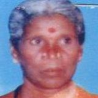

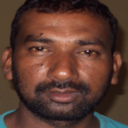
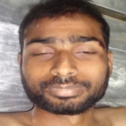

We initially renamed the images to make it readable, but as asked by jury we need to submit an excel sheet of the matches with the exact names, therefore due to time constrants we ran the model for  fewimages and uploaded a list in excel. The full dataset is uploaded to drive and the zip link is also provided. Excel has very few matches due to time constrast, but a pixel matching algorithm can be run later to obtain the exact names over the images in drive.

Drive_link = https://drive.google.com/drive/folders/1He07YpAtYEL91fCAkig9SYPqzOUhat_s

zip link = https://drive.google.com/file/d/1lVYkr9j11zjvOstEa1fZr4Z7maCwZINv/view?usp=sharing

## Facial Recognition over given database:

We have developed an Algorithm which gives **97.9 % accuracy**  which is comparable to the state of the art given it was trained over a very clean and good dataset. 

### Output - Person 1

person - Matched person

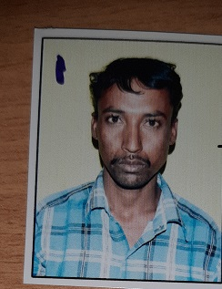
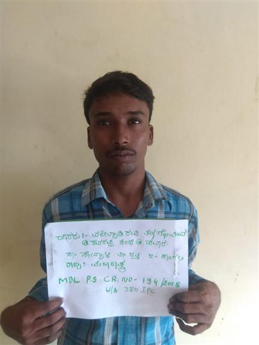

### Output - Person 2

person - Matched person

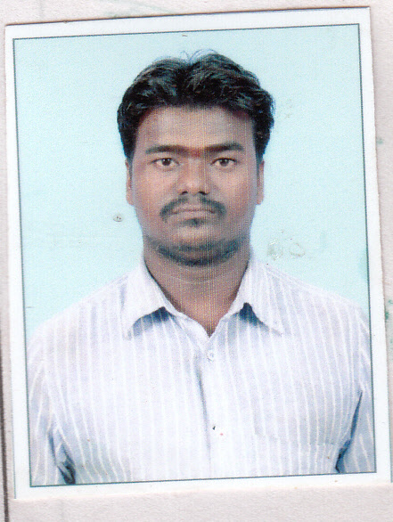
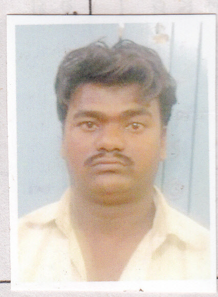

## Facial Recognition over internet data

We wanted to check the model performance on unseen type of data. So we have scraped web for data of 30 celebrities and were able to produce similar results as above mentioned

### Celebrity

Celebrity match

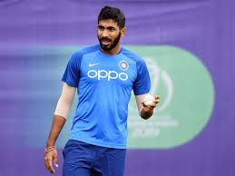
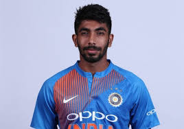

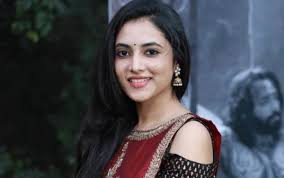
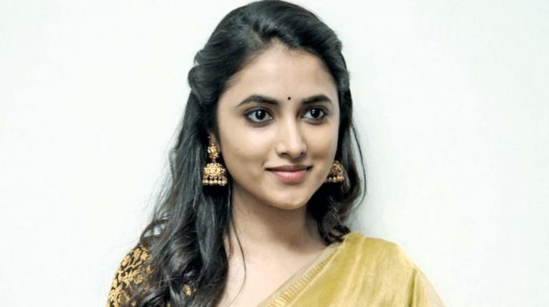

### Output

## Facial Recognition on different hardware data:

We wanted to test model reliability by checking with images taken from different hardware devices such as multiple phone cameras, webcam from computer etc. and our model was able to recognize all the variants with reliable accuracy.

# Train

**Train 1**
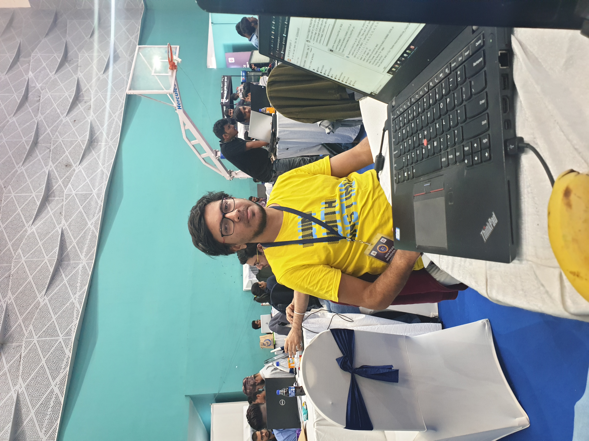

**Train 2**
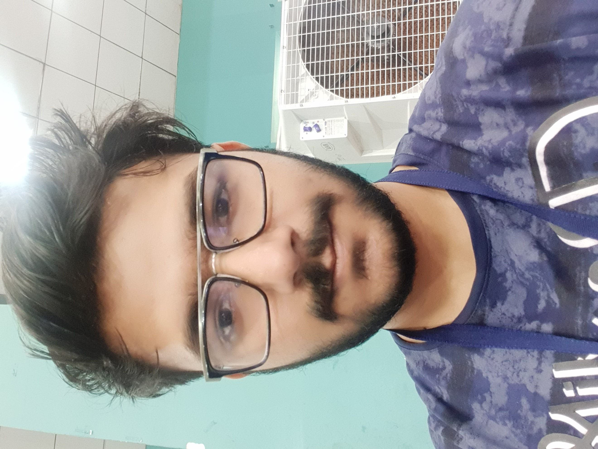

# Test

**test 1**

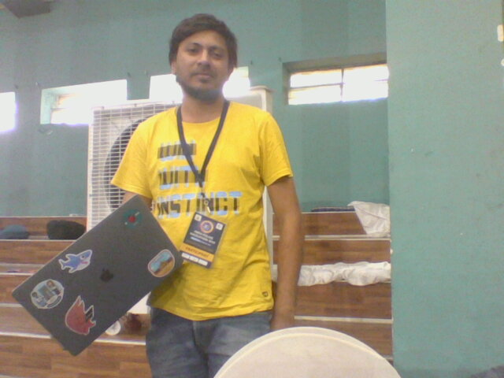
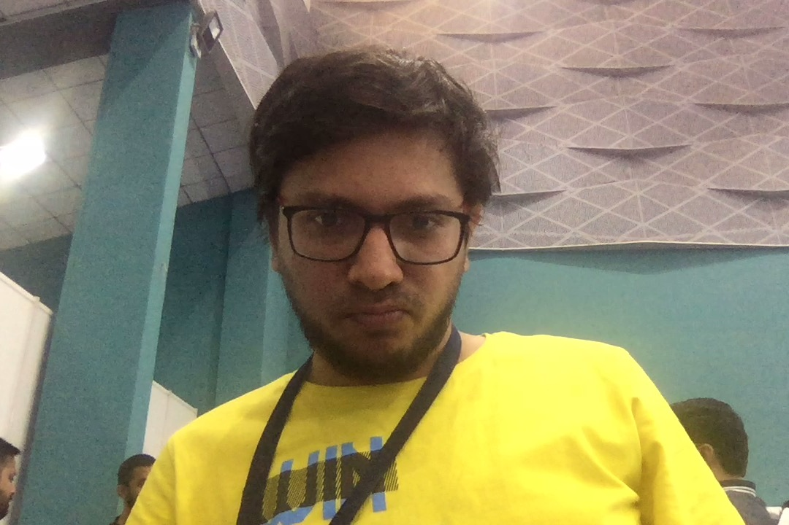

**test 2**

Results - 100% over different hardware specifications.

## Real Time Facial Recognition:

We ran the model over a live webcam and the model was able to work at a speed of 5 - 10 Frames Per Second(FPS).

# Choice of Technology	
* Tensorflow, Keras
* Google colab
* Open source India face dataset
* Facenet, MTCNN

# list of Tools used with version number
* Tensorflow = 1.15.0
* numpy = 1.16.1
* scipy = 1.1.0
https://drive.google.com/drive/folders/1He07YpAtYEL91fCAkig9SYPqzOUhat_s?usp=sharing
# Steps to build and run the project including minimum configuration needed
 * Add facenet folder to colab local directory
 * Run Colab jupitor Cells sequencially as given in submitted Facenet_all_match.ipynb file

