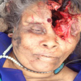
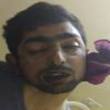

# Problem Statement

Find the photo of a missing person from police database or string of other official databases or some social media platforms and internet in general. Your task is to develop an App to capture a photo and search for the same in official databases using an optimized facial recognition algorithm.

# Data:

Set of 6000 Images of Missing/Arrested/Unnatural Death/ Wanted people

# Approach:

# Blockers when we started:

*  The Dataset Provided is of low resolution, hazzy, and inadequate in Number. 
*  The above blocker blocks us down to avoid OpenCv approach and directs us to Deep Neural Networks(DNN). Training a DNN requires a Huge amount of data. 

# Data Augmentation Techniques used:

We did a grid search to find the augmentation techniques:
* Random Crop.
* Random FLip_LR
* Guassian Noise
* Illumenance
* color channel changes

# Results:

We have developed a **robust** model which is tackle the following:

## Similar Face Matching:

The main task of the competition is to match images of people dead by natural causes with images from arrested/wanted/missing people images and to provide best match. As we can see the outputs are pretty awesome considering the limited amount of data and the noise present in most of the dead images

### Output

## Facial Recognition over given database:

We have developed an Algorithm which gives **97.9 % accuracy**  which is comparable to the state of the art given it was trained over a very clean and good dataset. 

## Facial Recognition over internet data:

We wanted to check the model performance on unseen type of data. So we have scraped web for data of 30 celebrities and were able to produce similar results as above mentioned

## Facial Recognition on different hardware data:

We wanted to test model reliability by checking with images taken from different hardware devices such as multiple phone cameras, webcam from computer etc. and our model was able to recognize all the variants with reliable accuracy.

## Real Time Facial Recognition:

We ran the model over a live webcam and the model was able to work at a speed of 5 - 10 Frames Per Second(FPS).
